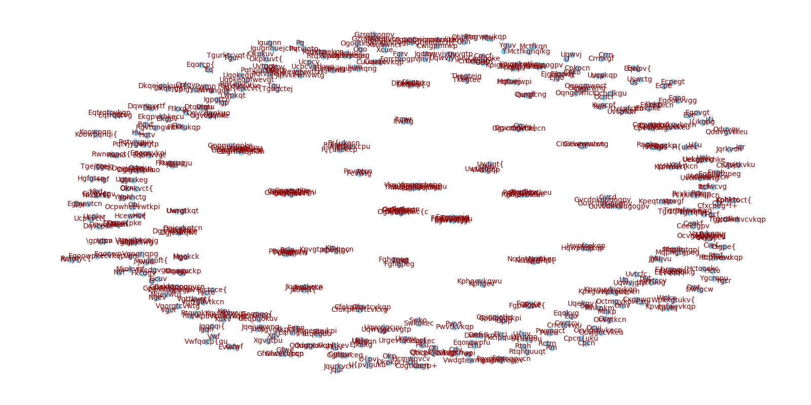
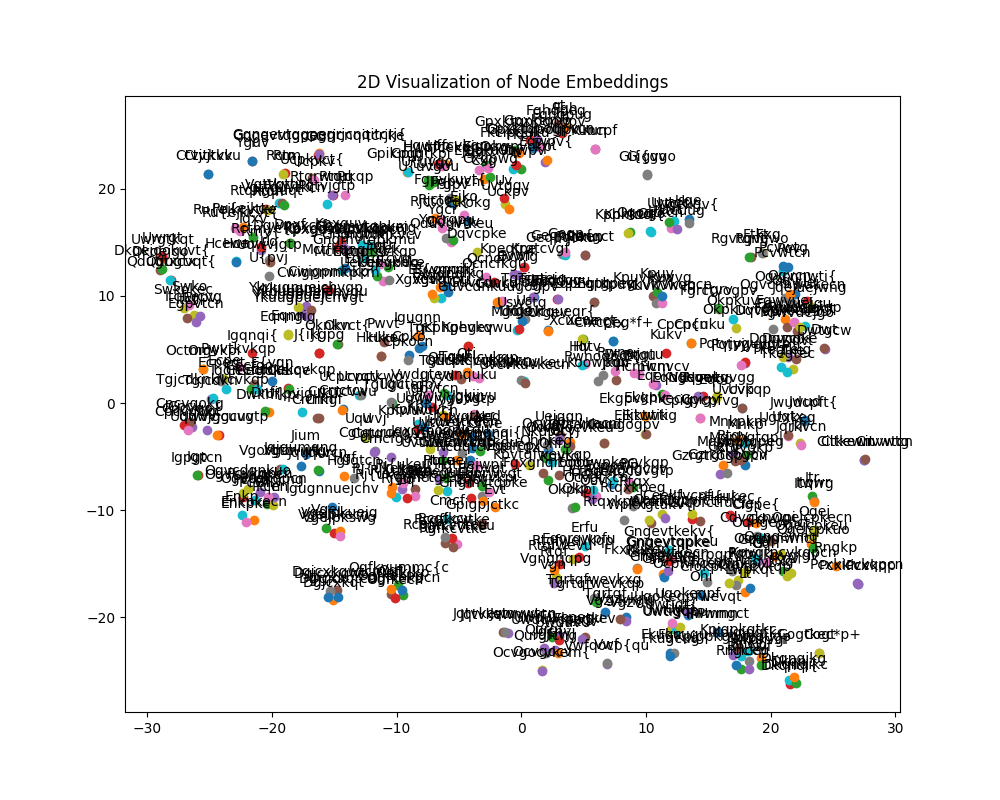

# 图表示模型

## 环境配置
项目提供了一键创建环境的脚本，确保环境中已经安装了make，只需要执行如下命令即可：
```bash
make env
```

如果你的环境中没有 `make` 命令，通常是因为你在使用 Windows 或者在 Linux/Unix 系统上未安装 `make`。根据你的操作系统，你可以选择安装 `make` 或者使用其他方法来执行相同的任务。这里我会提供两种方案：一种是安装 `make`，另一种是使用批处理或脚本手动执行相同的操作。


### Linux/Unix 
大多数 Linux 发行版都会包含 `make`，但如果没有，你可以通过包管理器安装它：
- 对于 Ubuntu/Debian 系统：
  ```bash
  sudo apt-get install build-essential
  ```
- 对于 Fedora/RHEL 系统：
  ```bash
  sudo dnf install make
  ```

### macOS 
`make` 可以通过 Xcode Command Line Tools 获得：
```bash
xcode-select --install
```
或者通过 Homebrew 安装：
```bash
brew install make
```

### Windows 
Windows 用户可以通过几种方式安装 `make`：
- **Cygwin**：提供了一个近似于 Linux 环境的解决方案。
- **MinGW** 和 **MSYS**：提供了基本的 GNU 工具集。
- **Chocolatey**：一个包管理器，可以用来安装 `make`：
  ```bash
  choco install make
  ```
- **WSL (Windows Subsystem for Linux)**：允许在 Windows 中运行 Linux 发行版。


## 模型训练
使用以下命令可以对模型进行训练，训练之后模型在当前路径下保存为`EnhancedGAT.pt`

```bash 
make train
```


## 模型测试

使用以下命令可以对模型进行测试，测试中给定模型部分节点，预测和给定节点最相关的n个节点。
```bash 
make infer
```

在推理阶段，模型可以根据输入的字符串预测出和输入的字符串最相关的字符串：
| 原文Token | 翻译Token |
| :---: | :---: |
| Dgjcx | Dgjcxkqt Dgjcxkqtcn Dgjcxkqwt Dgjcxkqwtcn |
| Fgwvuej | Fgwvuejg Fgwvuejgu Fgwvuejgp Fgwvuejgt Fgwvuejgo  |
|Ykuugpuej|Ykuugpuejchv Ykuugpuejchvgu Ykuugpuejchvgt Ykuugpuejchvgp|

```bach
与['Dgjcxkqt', 'Dgjcxkqtcn', 'Dgjcxkqwt']最相关的2个节点是: ['Dgjcxkqwtcn', 'Dgjcx']
与['Fgwvuejg', 'Fgwvuejgu', 'Fgwvuejgp', 'Fgwvuejgt']最相关的2个节点是: ['Fgwvuejgo', 'Ekgpv']
与['Ykuugpuejchv', 'Ykuugpuejchvgu', 'Ykuugpuejchvgp']最相关的2个节点是: ['Ykuugpuejchvgt', 'Ykuugpuej']
```
从测试中可以看出，模型能够根据输入的字符串预测出和输入的字符串最相关的字符串。


原始数据图可视化：


训练之后embedding可视化：

